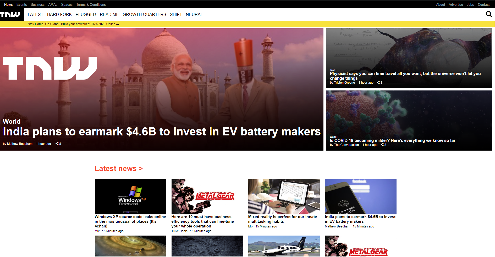

# Smashing Magazine

A Smashing Magazine Heatmap based on visual hierarchy. Grid and Flexbox used for most of the positioning on the page.

## Built With

- HTML5
- CSS3

## Live Demo

[Live Demo Link](https://raw.githack.com/jcy2704/smashing-magazine/design-ux/index.html)

## Getting Started

**This project was created for the sole purpose of understand design practices and UX. The following will be instructions on how you can see the project on your own computer.**

To get a local copy up and running follow these simple example steps.

### Prerequisites
Computer running Mac OS, Windows, or Linux Ubuntu.
Internet browser: Firefox, Google Chrome, Opera...

### Setup
Download the code or copy the git repository to your computer.

### Usage
Run the index.html file.

### Run tests
Linters errors

## Authors

👤 **Steven Jack Chung**

- GitHub: [@jcy2704](https://github.com/jcy2704)
- Twitter: [@yiak_](https://twitter.com/yiak_)
- LinkedIn: [Steven Jack Chung](https://linkedin.com/in/stevenjchung)

👤 **Janluc Saneaux**

- GitHub: [@Janluc](https://github.com/Janluc)
- Twitter: [@Janluc123](https://twitter.com/Janluc123)
- LinkedIn: [Janluc Saneaux](https://www.linkedin.com/in/janluc-saneaux-91707a1b4/)

## 🤝 Contributing

Contributions, issues, and feature requests are welcome!

Feel free to check the [issues page](https://github.com/jcy2704/smashing-magazine/issues).

## Show your support

Give a ⭐️ if you like this project!

## Acknowledgments

- Hat tip to anyone whose code was used
- Inspiration
- Smashing Magazine
